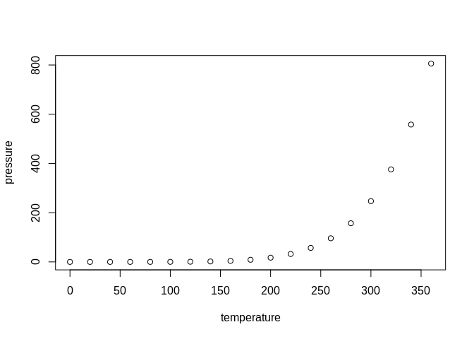

<!-- README.md is generated from README.Rmd. Please edit that file -->

# reproducibleCoursework

reproducibleCoursework is a folder containing everything you need to
ensure your coursework is reproducible.

## How it works

Reproducibility is essential for science. Saving your work as an
RMarkdown (.Rmd) file enables others to replicate what you have done.
RMarkdown files are special: this `README.Rmd` file, for example, allows
you to include R chunks like so:

``` r
summary(cars)
#>      speed           dist       
#>  Min.   : 4.0   Min.   :  2.00  
#>  1st Qu.:12.0   1st Qu.: 26.00  
#>  Median :15.0   Median : 36.00  
#>  Mean   :15.4   Mean   : 42.98  
#>  3rd Qu.:19.0   3rd Qu.: 56.00  
#>  Max.   :25.0   Max.   :120.00
```

Another great thing about `.Rmd` files is they can produce a range of
outputs. This file can be converted to a PDF document, for example, by
replacing `output: github_document` with `output: pdf_document` at the
top of the document.

Test it out by following these steps:

  - Download the template folder from
    <https://github.com/ITSLeeds/reproducibleCoursework/archive/master.zip>
  - Unzip it somewhere sensible on your computer
  - Open the project in RStudio by double-clicking on
    `reproducibleCoursework.Rproj` in a browser or via File \> Open in
    RStudio; you must have R and RStudio installed, see [Efficicient R
    Programming for more on
    this](https://csgillespie.github.io/efficientR/efficient-set-up.html)
    (Gillespie and Lovelace 2016)
  - Open and edit the file `README.Rmd`, e.g. by entering
    `file.edit("README.Rmd")`
  - ‘Knit’ the results, by clicking on the ‘Knit’ button or pressing
    `Ctl-Shift-K` in RStudio or executing the following command:

<!-- end list -->

``` r
knitr::knit("README.Rmd")
```

You can also embed plots, for example:

<!-- -->

If you want your work to be visible to others online, don’t forget to
commit and push the resulting figure files, so they display on GitHub\!

You can add citations easily to the `references.bib` file, in .bib
format.

Read more about the RMarkdown file format here:
<https://rmarkdown.rstudio.com/>

## Folder structure

Code lives in the `code` folder and minimal example datasets live in the
folder `minimal-example-data`. Only small datasets are kept in the repo
to avoid mixing code and data. Larger datasets should be hosted
elsewhere, e.g. on GitHub via the **piggyback** package.

## A simple example

Let’s explore road crashes in Leeds.

## References

<div id="refs" class="references">

<div id="ref-gillespie_efficient_2016">

Gillespie, Colin, and Robin Lovelace. 2016. *Efficient R Programming: A
Practical Guide to Smarter Programming*. O’Reilly Media.

</div>

</div>
